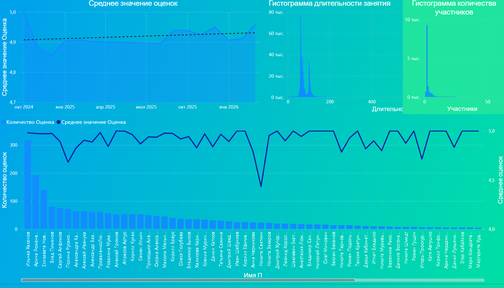
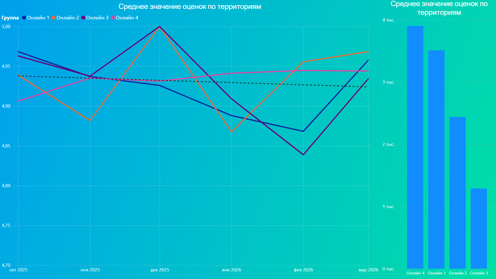
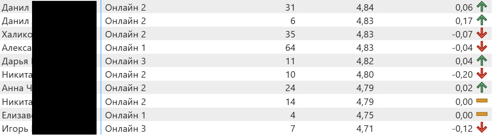
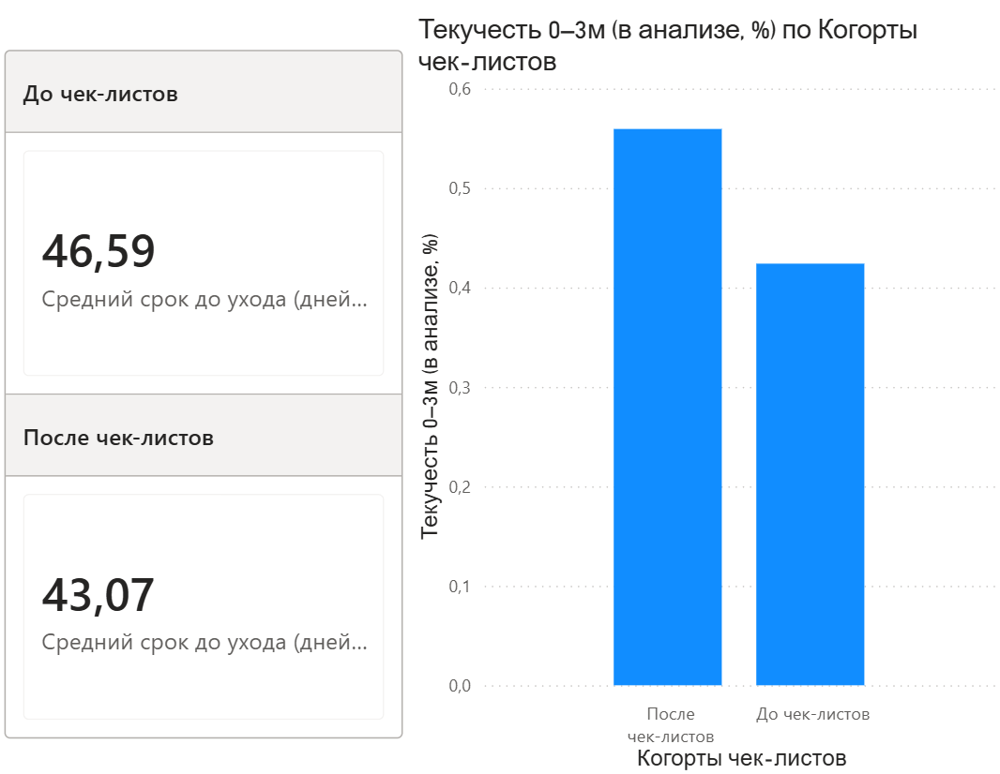

# Teacher Efficiency Measurement System

Система оценки эффективности преподавателей для онлайн-школы на основе данных Zoom, LMS и CRM.

Проект был разработан для решения задачи объективной оценки преподавателей и поиска факторов, влияющих на качество обучения, удержание учеников и финансовые показатели бизнеса.


## Контекст

В компании все преподаватели получали фиксированную оплату вне зависимости от результатов работы.

При этом руководство регулярно сталкивалось с вопросами:

- Какие преподаватели действительно эффективны?
- Какие факторы влияют на качество преподавания?
- Как измерить вклад преподавателя в бизнес-результат?
- Можно ли принимать кадровые решения на основе данных, а не субъективных оценок?

На момент начала проекта единая система оценки отсутствовала.


## Задача

Построить систему, которая позволит:

- собрать данные из разрозненных источников;
- сформировать единый профиль преподавателя;
- разработать измеримые показатели эффективности;
- выявить статистически значимые факторы успеха;
- предоставить инструмент для анализа результатов менеджменту.


## Моя роль

Полный цикл разработки аналитического решения:

- сбор требований бизнеса;
- проектирование метрик эффективности;
- разработка ETL-процессов;
- подготовка датасетов;
- статистический анализ;
- разработка интерактивных дашбордов;
- визуализация и презентация результатов руководству.

## Основная проблема

Ни одна из систем не содержала готовой метрики эффективности преподавателя.

Дополнительную сложность создавало то, что один ученик мог заниматься сразу у нескольких преподавателей.

Поэтому прямое связывание прибыли или LTV с конкретным преподавателем давало искаженные результаты.


## Решение

Была разработана собственная система оценки эффективности.

### Архитектура решения

## Архитектура решения

```text
                 Zoom
                   │
         Python Parser / ETL
                   │
                   ▼

             ┌─────────┐
             │         │
iSpring Learn│         │ CRM ListOk
      │      │         │      │
      └──────┤ Единая  ├──────┘
             │аналитич.│
             │ модель  │
             └────┬────┘
                  │
      ┌───────────┼───────────┐
      │           │           │
      ▼           ▼           ▼
Расчет      Корреляционный   Поиск
метрик         анализ      факторов
                            эффективности
      └───────────┼───────────┘
                  │
                  ▼
        Дашборды и отчеты
```

### Шаг 1. Объединение данных

Создан единый аналитический слой, объединяющий данные из:

- **Zoom**: все отзывы учеников на занятия с привязкой к преподавателю. Так как в Zoom не предусмотрено единого отчета со всей нужной информацией, был написан скрипт на Python, сопоставляющий информацию о конференциях с отзывами. Отчеты скачивались вручную, затем прогонялись через скрипт для получения единой CSV-таблицы.;
- **LMS-система iSpring Learn**: срок работы преподавателей, результаты оценок проведенных занятий по чек-листам от руководителей и специалистов по обучению, результаты проводимой ежеквартально Оценки знаний - теста для оценки знаний сотрудниками продукта;
- **CRM-система ListOk**: LTV и LifeTime учеников, прибыль, принесенная каждым учеников в разрезе по преподавателям, которые проводили эти занятия.

Для преподавателей была реализована система сопоставления записей между системами.

### Шаг 2. Разработка метрик

**NPS**. Вначале был разработан скрипт на Python, собирающий разрозненную информацию из отчетов Zoom и интегрирующий их в единую таблицу со всеми необходимыми данными(ФИО сотрудника, ID конференции, ФИО ученика, оценка, комментарий и др.). 

**Кастомные метрики**. Использование других стандартных метрик, встречающихся в данном контексте(COR, retention), было осложнено ограниченными возможностями CRM и других систем. Поэтому было принято решение реализовать кастомные метрики.

Ключевая метрика - **LTV_ValueNorm** рассчитывает общий LTV студента, скорректированный на долю (вес) конкретного преподавателя. Простыми словами, она берет общую пожизненную ценность студента (все деньги, что он принес компании) и делит ее между его учителями пропорционально тому, сколько уроков они провели.

```
Пошаговый алгоритм расчета:

Для каждой строки виртуальной таблицы (где пересекаются конкретный студент и конкретный преподаватель) выполняются три шага:

1. Определение веса (w). Код считывает значение Weight_Value, которое было рассчитано на предыдущем этапе (доля уроков учителя у этого студента).

2. Расчет базового LTV (LTVt)
VAR LTVt =
    CALCULATE (
        SUM ( 'Выгрузка'[LTV общий] ),
        KEEPFILTERS ( 'Выгрузка'[StudentName] = s )
    )
Из таблицы 'Выгрузка' берется общая сумма по колонке [LTV общий] для текущего студента. Функция KEEPFILTERS гарантирует, что расчет произойдет строго по этому студенту, сохраняя внешние фильтры отчета (например, если в отчете выбрана конкретная дата или регион).

3. Финальное перемножение
RETURN LTVt * w
Полученный общий LTV студента умножается на вес преподавателя.
```

Для каждого преподавателя вычисляется сумма таких нормированных величин по каждому ученику, и нормируется на срок работы преподавателя т.е.:

$$\sum\limits_{по\ всем\ ученикам}\frac{LTV\_ ученика * вес\_ преподавателя}{срок\ работы\ преподавателя}$$

>Нормировка на стаж необходима, так как исходная метрика растет естественным образом с увеличением срока работы: в общем случае чем дольше работает преподаватель, тем больше у него было проведено занятий, следовательно тем больше полученный LTV_ValueNorm.

Такая метрика призвана увеличить результаты эффективности тех преподавателей, которые долго ведут занятия у одного ученика, не передавая его другим. 

Метрика **Weight_Value** рассчитывает долю (вес) преподавателя в общем объеме занятий конкретного студента. Если данных по занятиям нет, вес распределяется поровну между всеми преподавателями этого студента. Если преподаватель не вел занятий у конкретного ученика, его вес для этого ученика будет равен 0.

```Пошаговая логика расчета

Для каждой уникальной пары «Преподаватель — Студент» собирается три показателя:

- amtT (Объем преподавателя): сумма всех занятий (Amount) конкретного студента с конкретным преподавателем.
- amtS (Всего у студента): общая сумма всех занятий этого студента со всеми его преподавателями.
- k (Количество учителей): общее число уникальных преподавателей, закрепленных за этим студентом.

Далее срабатывает логическое условие IF ( amtS > 0, DIVIDE ( amtT, amtS ), DIVIDE ( 1, k ) ):

Вариант 1 (Основной): Если у студента есть проведенные занятия (amtS > 0), то вес равен amtT / amtS. Это математическая доля уроков данного учителя от всех уроков студента.

Вариант 2 (Запасной): Если у студента еще не было занятий (amtS = 0), то вес считается как 1 / k. То есть 100% веса делятся поровну между всеми его учителями.
```

Далее был проведен корреляционный анализ этой метрики к другим данным, собранным по преподавателям:
- С оценками по чек-листам руководителей
- С оценками по чек-листам специалистов по обучению
- С оценками занятий от учеников
- С результатами Оценки знаний

Для сопоставления преподавателей между различными источниками и проведения анализа были написаны Python-скрипты.

## Разработка

В папке `zoom_parser` содержатся файлы парсера информации о занятиях Zoom для сбора информации об NPS.

В файле `analysis.py` содержатся все функции для корреляционного анализа.

В файле `insight_srotyboard1.py` содержится код отчета-сториборда с ключевыми выводами корреляционного анализа. Для руководителей он также был задеплоен по [ссылке](https://teacher-efficiency-measurment-system.streamlit.app/), однако сейчас она не поддерживается.

Также были сформированы PowerBI-отчеты, которые не приводятся здесь по соглашению с работодателем. В частности:
- Отчет по NPS. Результаты этого PowerBI-отчета ежемесячно обновляются и направляются руководителям.



- Отчет по анализу эффективности новых мер методистов на удержание преподавателей: процедуры наставничества новых преподавателей, а также проверки по особым чек-листам. Номинально меры не показали свою эффективность, однако количества данных, доступных для анализа, оказалось недостаточно для принятия решения на основании полученных результатов. Было рекомендовано повторить анализ через 3-6 месяцев.


## Общие выводы

Таким образом, по логике формирования кастомной метрики LTVNorm и ее анализу ясно, что наиболее эффективными преподавателями становились сотрудники, которые не совмещают работу с другой занятостью(для подтверждения был проведен социальный опрос). 

Наибольший вклад в долгосрочную ценность вносят опыт преподавателя и его знание продукта. При этом показатели удовлетворенности клиентов (NPS) имеют отрицательную связь как с LTV, так и с уровнем знаний. Это говорит о необходимости рассматривать качество сервиса и коммерческую эффективность как разные управленческие задачи и искать баланс между ними, а не управлять преподавателями исключительно через NPS.

## Результаты

Несмотря на то что итоговая система не была внедрена в первоначальном виде, проект позволил получить практический эффект.

### Бизнес-результат

По результатам анализа были выявлены неэффективные процессы и перераспределены ресурсы отдела обучения.

Результат:

- сокращение расходов отдела обучения примерно на 20%;
- появление объективных критериев оценки преподавателей;
- повышение прозрачности кадровых решений;
- формирование базы для дальнейшей системы мотивации сотрудников.

---

## Технологический стек

### Аналитика

- Python
- Pandas
- NumPy
- SciPy

### Визуализация

- Streamlit
- Plotly

### BI

- Power BI

### Сбор данных

- Playwright
- Zoom Reports API / экспорт отчетов

---

## Структура проекта

```text
teacher-efficiency-measurment-system/
│
├── analysis.py
│   ├── очистка данных
│   ├── объединение источников
│   ├── расчет метрик
│   └── статистический анализ
│
├── insight_storyboard1.py
│   └── интерактивный аналитический сториборд
│
├── zoom_parser/
│   ├── full_pipeline.py
│   └── автоматизация выгрузки Zoom
│
└── README.md
```

## Ключевые навыки, продемонстрированные в проекте

- Product Analytics
- HR Analytics
- Educational Analytics
- Data Modeling
- ETL
- Python
- Statistical Analysis
- Hypothesis Testing
- Dashboard Development
- Business Intelligence
- Metric Design
- Stakeholder Communication

## Что особенно интересно в проекте

Проект демонстрирует не только работу с данными, но и способность разрабатывать методологию оценки с нуля в условиях отсутствия готовых метрик и ограниченного качества исходных данных.

Основная ценность заключалась в переводе абстрактного вопроса бизнеса «кто из преподавателей работает эффективно?» в измеримую систему показателей, пригодную для принятия управленческих решений.
